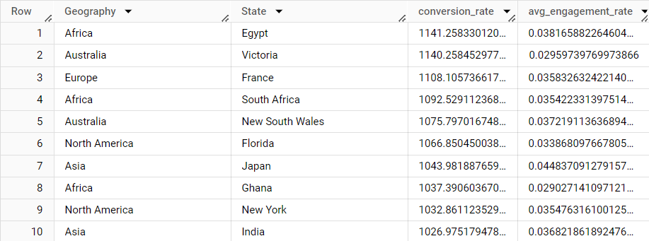
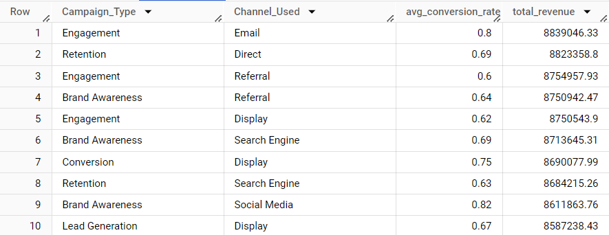
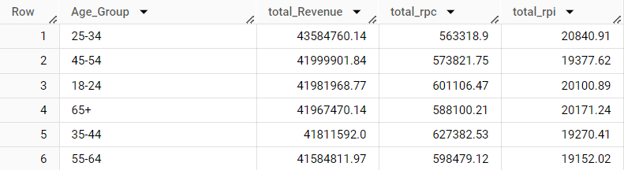
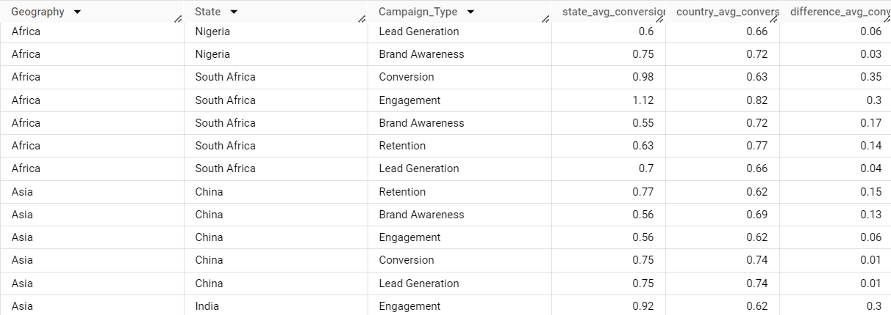
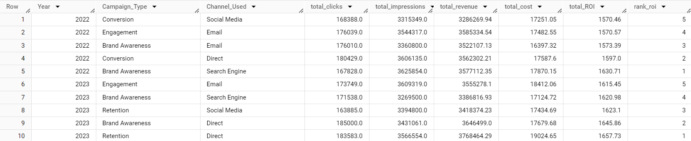
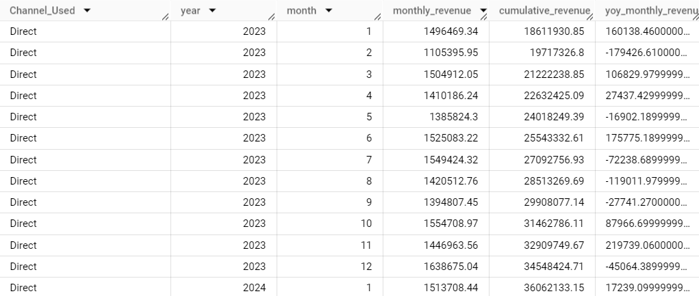

# Marketing Campaign Analysis Project

This repository contains the BigQuery SQL scripts and Looker dashboard components for a comprehensive analysis of marketing campaign performance across different dimensions such as geography, channel, age group, and campaign type. The project aims to provide actionable insights to optimize marketing strategies and maximize return on investment (ROI).

# Overview

The primary objectives of this project are:

- Analyzing campaign performance by geography and comparing state-level performance with country-wide averages.
- Evaluating the effectiveness of different marketing channels.
- Understanding revenue distribution across age groups.
- Identifying the top-performing campaigns based on ROI.
- Analyzing monthly revenue trends by channel.

Data processing is done using SQL queries executed in Google BigQuery, and the results are visualized through interactive dashboards in Looker.

# Key Analyses

1. **Campaign Performance by Geography**
This analysis calculates the conversion rate and engagement rate for marketing campaigns across various states and geographic regions.

3. **Channel Effectiveness**
This view ranks marketing channels based on average conversion rates and total revenue generated.

4. **Revenue Distribution by Age Group**
This analysis segments revenue and revenue-per-click by age group to understand which demographics drive the most value.

5. **State vs. Country Campaign Performance Comparison**
This view compares state-level conversion rates with country-wide averages, identifying discrepancies in performance for better targeting strategies.

6. **Top Campaigns by ROI**
This analysis tracks monthly revenue for each marketing channel, showing year-over-year revenue differences to understand seasonality and growth trends.

7. **Channel Performance and Monthly Revenue Trends**
This analysis tracks monthly revenue for each marketing channel, showing year-over-year revenue differences to understand seasonality and growth trends.

# Looker studio Report

The results from the above queries are visualized in a Looker dashboard, providing an intuitive interface to explore key metrics such as total ROI, revenue trends, and conversion rates across various dimensions.

[View the Live Dashboard here](https://lookerstudio.google.com/s/g42tsUwjO_Q)

## Technical Components

- **Google BigQuery:** For large-scale data processing and querying.
- **Looker:** For interactive dashboard visualization.
